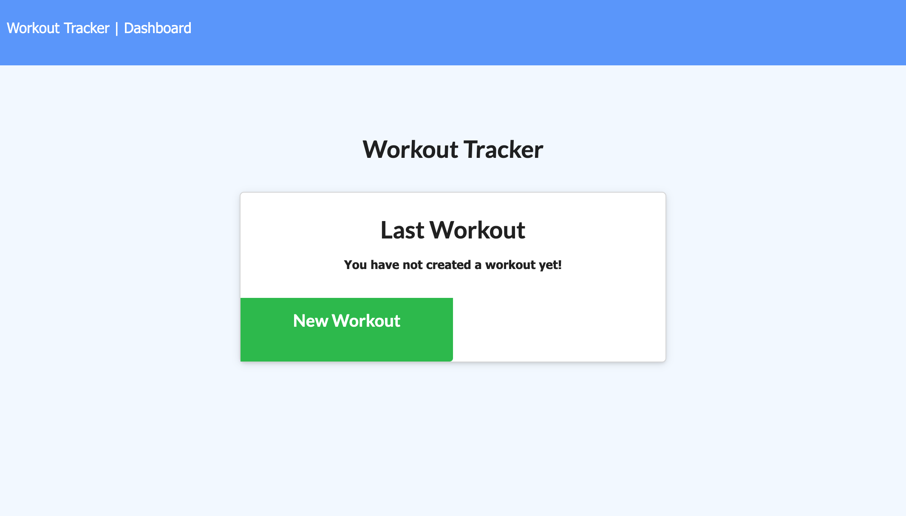
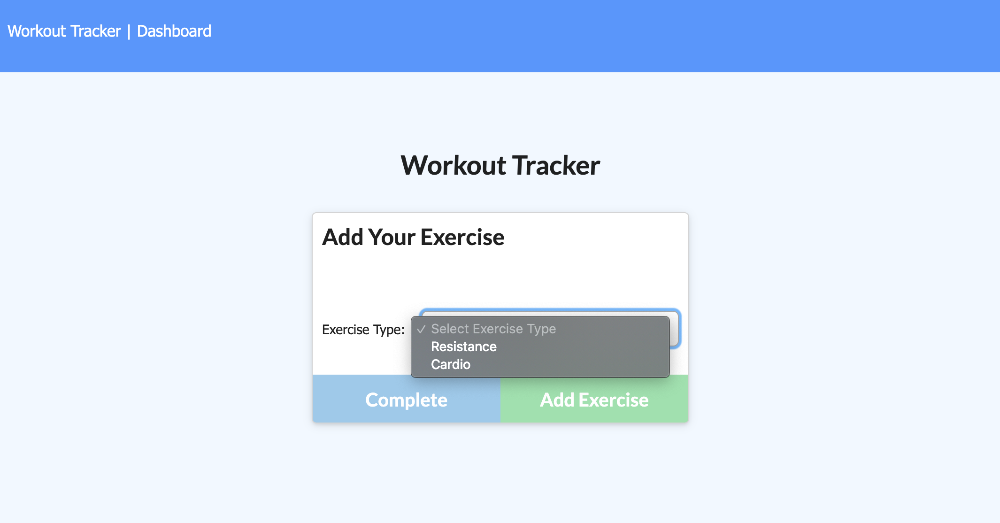
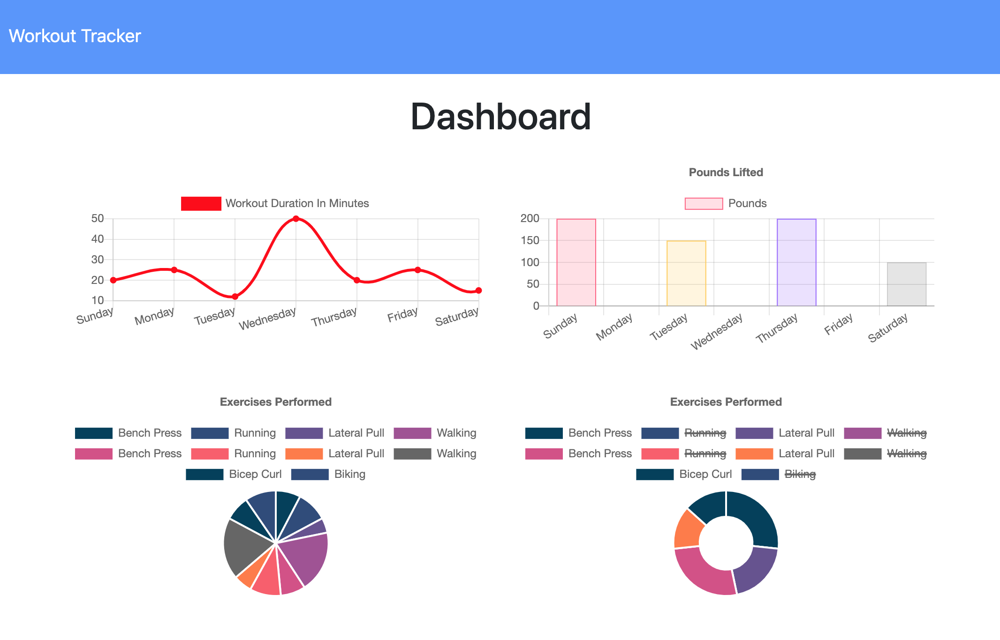
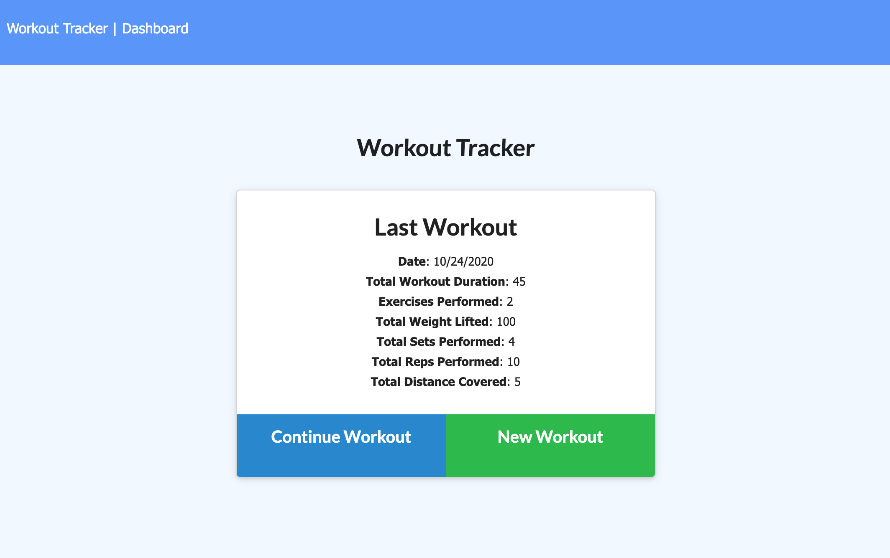

# My Workout Tracker

  ## Table of Contents
  - [Project description](#project-description)
  - [User story](#user-story)
  - [Installation](#installation)
  - [Features](#features)
  - [Application preview](#application-preview)
  - [Technology](#technology-and-framework)
  - [Contributing](#contributing)
  - [Questions](#questions)
  - [License](#license)

  ## Project Description
 [**My Workout Tracker**](https://jpx-workout-tracker.herokuapp.com/) app creates and tracks daily workouts, the user can log multiple resistance and cardio exercises. The app assists users to reach their fitness goals more quickly by tracking their workout progress and providing the relevant information of each exercise and workout.

  ## User Story
  - - -
  - As a user, I want to be able to view create and track daily workouts. 
  - I want to be able to log multiple exercises in a workout on a given day.
  - I should also be able to track the name, type, weight, sets, reps, and duration of exercise.
  - If the exercise is a cardio exercise, I should be able to track my distance traveled.
  - - -

  ## Installation
  The **Workout Tracker** app is hosted on heroku with a MongoDB database, no special installation is required other than a web browser for mobile or desktop devices. ([**Google Chrome**](https://www.google.com/chrome/?brand=CHBD&gclid=Cj0KCQjwv7L6BRDxARIsAGj-34pI6kcGFGrZkxQgztLSwZZ7JzwQJFBfDBdgTHCurYEpg3QscMjHhYUaAkkjEALw_wcB&gclsrc=aw.ds) is recommended).

  ## Features
  **My Workout Tracker:** 
  - Gives to users the option to create a new workout or continue with their last workout.
  - Adds exercises to a previous workout plan.
  - Adds new exercises to a new workout plan.
  - Displays the combined weight of multiple exercises.
  - Displays the latest exercise on the front page.
  - Displays all the exercises on the `stats` page.

  ## Application Preview

  

  

  

  

  ## Technology and Framework  
  - Express
  - MongoDB
  - Mongoose
  - Heroku
  - Dotenv

  ## Contributing
  
 
  
 
 
 [Application repository](https://github.com/JonPhoenix/my-workout-tracker)

  ## Questions
  - For further questions, please contact the author at: jonphx@uw.edu

  ## License
    MIT

